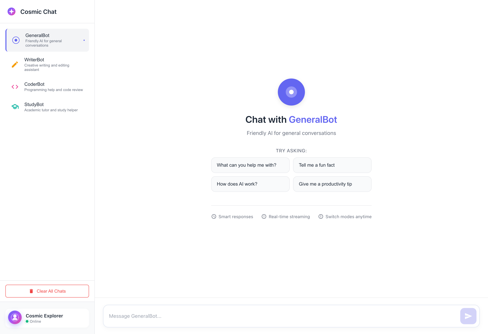
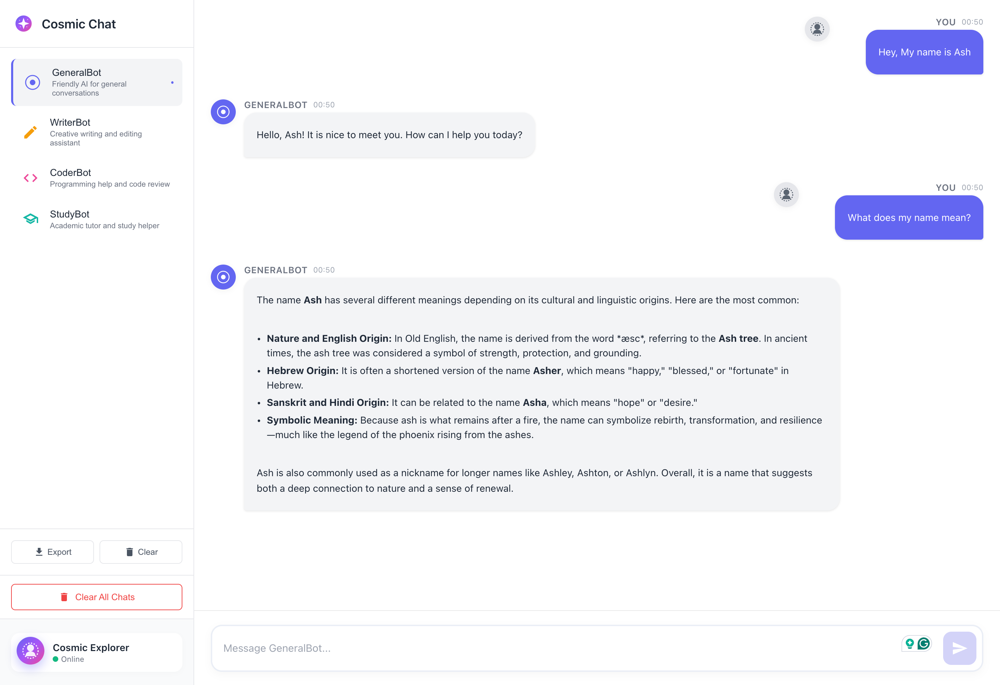
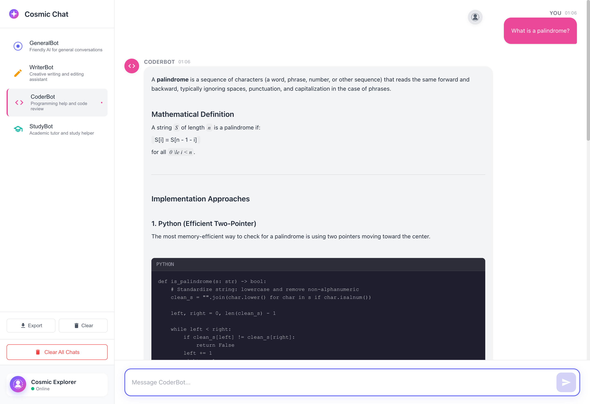
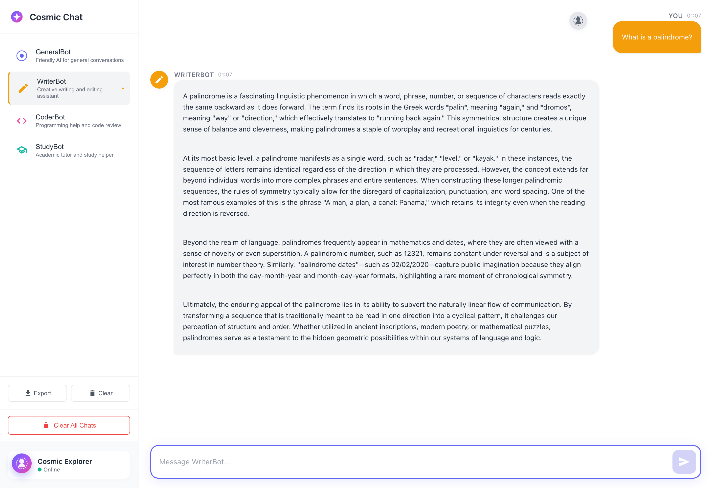

<div align="center">

# Cosmic Chat — Gemini Multi-Mode AI Chatbot

[](https://nodejs.org/)
[](https://reactjs.org/)
[](https://expressjs.com/)
[](https://deepmind.google/technologies/gemini/)
[](LICENSE)
[](https://github.com/firstcontributions/first-contributions)

*Real-time streaming responses · Multiple AI personas · Persistent conversations · Cosmic-themed UI*

</div>

---

## Overview

Cosmic Chat is a full-stack AI chatbot that provides the experience of conversing with multiple specialized assistants — each with their own personality, area of expertise, and isolated conversation memory. Built on Google Gemini's streaming API, responses render progressively for a natural, immersive feel.

> Designed as a production-style project focused on real-time AI UX and clean modular architecture.

---

## Key Features

### AI & Backend

- Multi-mode AI personas via custom system instructions
- Real-time token streaming using Gemini's streaming API
- Resilient retry logic with exponential backoff for 503/429 errors
- Stateless backend design for simplicity and scalability
- Clean controller/service separation for maintainability

### Frontend Experience

- Per-mode conversation isolation — each assistant maintains its own memory
- LocalStorage persistence — conversations survive page refreshes
- Character-by-character typing effect for a natural UX
- Custom lightweight markdown parser with no heavy dependencies
- Hover-to-copy message support
- Fully responsive cosmic-themed UI

---

## Screenshots

**Landing Page**



**Contextual Memory**



### Same Question, Different Modes

**Coder Mode** — "What is a palindrome?"



**Writer Mode** — "What is a palindrome?"



---

## Tech Stack

| Layer | Technology |
|-------|-----------|
| Frontend | React, Fetch Streaming API, LocalStorage |
| Backend | Node.js, Express |
| AI | Google Gemini (`@google/genai`) |
| Styling | Custom CSS |

---

## Project Structure

```
cosmic-chat/
├── frontend/
│   ├── src/
│   │   ├── components/        # UI components
│   │   ├── styles/            # CSS styles
│   │   └── App.js             # Root component
│   └── .env                   # Frontend environment variables
├── backend/
│   ├── config/                # Configuration files
│   ├── controllers/           # Request handlers
│   ├── routes/                # API routes
│   ├── services/              # Gemini API logic
│   └── server.js              # Entry point
└── README.md
```

---

## Getting Started

### Prerequisites

- [Node.js](https://nodejs.org/) v18 or higher
- npm
- A valid [Google Gemini API key](https://aistudio.google.com/app/apikey)

### 1. Clone the Repository

```bash
git clone https://github.com/Ash-the-k/cosmic-chat.git
cd cosmic-chat
```

### 2. Configure Environment Variables

**Backend** — create `backend/.env`:
```env
GEMINI_API_KEY=your_api_key_here
 
```

**Frontend** — create `frontend/.env`:
```env
REACT_APP_API_BASE_URL=http://localhost:5001
```

> **Note:** Never commit your real API key. Add `.env` to your `.gitignore`.

### 3. Install Dependencies

```bash
# Backend
cd backend
npm install

# Frontend
cd ../frontend
npm install
```

### 4. Start the Application

**Terminal 1 — Backend:**
```bash
cd backend
node server.js
# Server running on port 5001
```

**Terminal 2 — Frontend:**
```bash
cd frontend
npm start
# App running at http://localhost:3000
```

---

## How Streaming Works

```
User sends message
       |
       v
React UI  →  POST { message, history, mode }
       |
       v
Backend calls Gemini Streaming API
       |
       v
Text chunks stream back via HTTP
       |
       v
Frontend renders character-by-character (5ms delay)
```

---

## AI Modes

| Mode | Persona | Best For |
|------|---------|----------|
| `default` | General assistant | Everyday questions |
| `writer` | Polished content writer | Essays, creative writing, copywriting |
| `coder` | Technical programming expert | Code, debugging, architecture |
| `study` | Step-by-step tutor | Learning, explanations, homework help |

Each mode carries its own system instruction and fully isolated conversation history.

---

## Persistence Model

Conversation history is stored in LocalStorage automatically:

- Saves after every message
- Survives page refresh and browser restart
- Maintains separate history per AI mode
- Supports export and clear operations

---

## Resilience Strategy

The backend retries failed Gemini requests using exponential backoff:

| Scenario | Behaviour |
|----------|-----------|
| 503 — Model overloaded | Retry with backoff |
| 429 — Rate limited | Retry with backoff |
| Retry schedule | 1s → 2s → 4s |
| After streaming begins | Fail gracefully, no retry |

---

## Design Principles

1. **Streaming-first UX** — responses appear as they are generated
2. **Stateless backend** — no session state held on the server
3. **Per-mode memory isolation** — clean, scoped context per persona
4. **Lightweight custom markdown** — no bloated third-party renderers
5. **Fail-gracefully philosophy** — errors are handled cleanly at every layer

---

## Possible Future Enhancements

- Multi-chat sessions within each mode
- Database persistence (MongoDB / PostgreSQL)
- Replace custom markdown with a well-tested library
- Rate limiting middleware
- Full deployment configuration (Docker / cloud)
- RAG (Retrieval-Augmented Generation) integration
- User authentication and multi-user support

---

## Acknowledgements

- [Google Gemini](https://deepmind.google/technologies/gemini/) — AI backbone
- [React](https://reactjs.org/) — frontend framework
- [Express](https://expressjs.com/) — backend framework

---

## License

This project is licensed under the MIT License. See the [LICENSE](LICENSE) file for details.

---

<div align="center">

Cosmic Chat is designed as a production-style learning project focused on real-time AI UX and clean architecture.

</div>